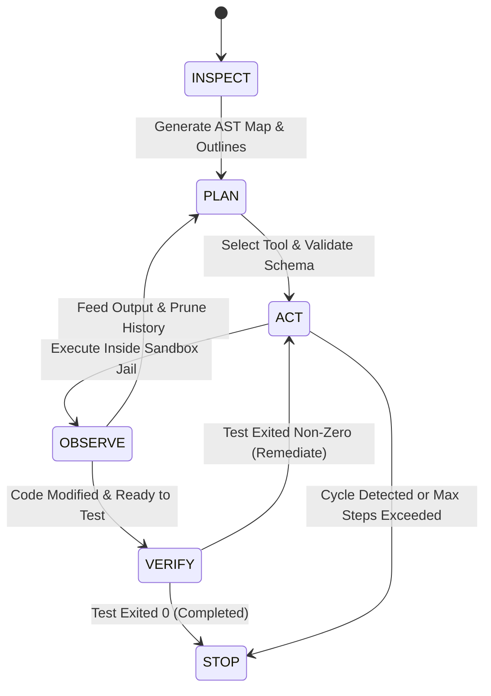

# CodeForge (`my-harness`)

Autonomous repository-aware coding-agent runtime and orchestration harness built for the AI Track Induction 2026 (Task 09: CodeForge).

`my-harness` is not a conversational chatbot wrapper. It is a verified runtime state machine that accepts a software engineering task and a target repository path, inspects the codebase, plans modifications, executes sandboxed tools, applies targeted diff patches, runs automated tests, and verifies completion before halting.

---

## 1. Architectural Invariants

The harness strictly enforces four core invariants across all executions:

1. **Zero Unvalidated Tools**: Every tool invocation must parse and validate against strict Zod schemas. Free-form text generation cannot bypass schema validation.
2. **Repository Sandbox Jail**: Every path operation is verified through canonical realpath containment. File access outside the target repository is rejected with a security fault.
3. **Mandatory Verification Gate**: The agent cannot declare task completion without first applying code changes and successfully running the repository's test command with exit code 0.
4. **Deterministic Telemetry & Traces**: Every turn, tool invocation, token count, duration, and diff is recorded in structured JSON format under `traces/run_<id>.json`.

---

## 2. Finite State Machine (FSM)

The runtime operates as a 6-stage finite state machine:



### Stage Definitions

- **INSPECT**: Analyzes repository structure via `RepoMapper`, extracting classes, functions, interfaces, and line numbers into a compact symbol map injected at turn 0.
- **PLAN**: Sends conversation context and tool declarations to the model (`deepseek/deepseek-chat` via OpenRouter).
- **ACT**: Parses tool calls with Zod, validates parameter bounds, evaluates against `LoopDetector` for cycle prevention, and snapshots affected files for atomic rollback.
- **OBSERVE**: Executes the tool within the sandbox jail, applies line-and-char bounded truncation, and returns standard outputs to the agent context.
- **VERIFY**: Evaluates whether code modifications occurred. If modified, mandates test suite execution (`run_command`). Rejects completion if tests fail.
- **STOP**: Writes the full JSON execution trace to disk, saves the session checkpoint to `.inductionharness/`, and exits with the corresponding status code.

---

## 3. Tool Suite Matrix

| Tool | Schema / Arguments | Description & Security Guardrail |
| :--- | :--- | :--- |
| `list_dir` | `{ path?: string, recursive?: boolean, max_depth?: number }` | Enumerates directory entries with depth bounds. Ignores `.git` and `node_modules`. |
| `file_search` | `{ query: string, path?: string }` | Fast recursive filename search with case-insensitive pattern matching. |
| `grep_search` | `{ query: string, path?: string, is_regex?: boolean }` | Searches file contents and returns exact line numbers with matching line content. |
| `read_file` | `{ path: string, start_line?: number, end_line?: number }` | Reads file content with 1-indexed line numbering and optional line range slicing. |
| `write_file` | `{ path: string, content: string, overwrite?: boolean }` | Creates new files or writes complete file contents. Snapshots target prior to write. |
| `apply_patch` | `{ path: string, search_block: string, replace_block: string }` | Targeted search-and-replace with exact match, NFKC unicode normalization, and smart quote leniency. |
| `run_command`| `{ command: string, timeout_ms?: number }` | Executes commands inside the repository sandbox. Enforces 30s timeout and process group SIGKILL. |
| `git_status` | `{}` | Lists staged, unstaged, and untracked files in the target repository. |
| `git_diff` | `{ path?: string }` | Returns working tree unified diffs against git HEAD. |
| `git_restore`| `{ path: string }` | Reverts uncommitted changes using atomic file snapshot restoration or git restore. |

---

## 4. Sandboxing & Safety Subsystem

### Path Confinement (`SandboxJail`)
- Resolves all paths relative to the canonical repository root using `fs.realpathSync`.
- Verifies containment with `path.relative(root, resolved)`: paths starting with `..` or pointing outside the root raise an explicit security error.
- Rejects paths containing null bytes (`\0`).

### Subprocess Execution (`ProcessExecutor`)
- Commands run with `detached: true` in an isolated process group.
- On timeout (default 30,000ms), the entire process tree is terminated via `process.kill(-proc.pid, "SIGKILL")`.
- Raw buffer output is capped at 64KB before processing.

### Output Truncation (`OutputTruncator`)
- Truncates oversized outputs to a maximum of 40 lines (first 15 lines + last 25 lines) and 2,500 characters.
- Injects explicit truncation notices with hidden line counts to preserve agent context without overflowing token limits.

### Cycle & Thrash Detection (`LoopDetector`)
- Computes canonical SHA-256 fingerprint hashes of `(tool_name, arguments)`.
- At 3 consecutive identical tool calls: injects a warning into the agent conversation to prompt strategy revision.
- At 4 consecutive identical tool calls: immediately halts execution with status `CYCLE_DETECTED`.
- Detects periodic alternating ping-pong loops (e.g., A -> B -> A -> B -> A -> B) and aborts execution.

### Targeted Diff Engine & Atomic Rollback (`RollbackManager`)
- Performs atomic file snapshots before applying any file modifications.
- If a patch or write operation breaks tests and requires recovery, `rollbackFile(path)` or `rollbackAll()` restores the exact file state without side effects.

---

## 5. Benchmark Suite & Evaluation

The repository includes a 15-task benchmark suite defined in `benchmarks/tasks.json` across two heterogeneous test repositories:

1. **`repo-a` (`nano-router`)**: A lightweight TypeScript URL routing engine with zero dependencies (runnable with `node --test`).
2. **`repo-b` (`state-flow`)**: A Python finite state machine library (runnable with `python3 -m unittest`).

Tasks span 4 categories:
- `bug`: Reproducing and fixing edge cases (parameter parsing, trailing slashes, handler collisions).
- `feature`: Extending functionality (wildcard matching, middleware pipelines, route grouping).
- `refactor`: Extracting modular parsers while preserving 100% test compatibility.
- `test`: Adding edge case unit tests for query string decoders and transition payloads.

---

## 6. Empirical A/B Comparative Experiment

An A/B comparative experiment was conducted comparing **Design A (CodeForge Proposed System)** against **Design B (Naive Baseline Agent)**:

| Dimension | Design A (CodeForge) | Design B (Naive Baseline) |
| :--- | :--- | :--- |
| **Context Initialization** | Compact AST Architecture Map (classes, functions, lines) | Blind (no repo map injected) |
| **Verification Gate** | Required test exit code 0 post-modification | Optional (agent claims done without tests) |
| **Diff Engine** | Targeted fuzzy search-and-replace + atomic rollback | Full file overwrites |
| **Cycle Protection** | Rolling SHA-256 fingerprint loop detector | Unbounded loop risk |

### Key Experimental Findings
1. **Verification Gate Prevents Hallucinated Completion**: Without an enforced verification gate, baseline agents declare task completion based on plausible-looking code edits without actually executing test suites. CodeForge forces test execution and autonomously self-heals when tests fail.
2. **AST Map Minimizes Exploration Overhead**: Injecting the AST symbol outline dramatically reduces blind exploration rounds (`list_dir`, `file_search`), resulting in faster convergence and lower token usage.
3. **Loop Detection Protects Budgets**: The 4-strike cycle detector eliminates runaway API spend on repeating failed commands.

Detailed experimental logs and task-by-task results are recorded in `benchmarks/REPORT.md` and `benchmarks/EXPERIMENT_AB.md`.

---

## 7. Installation & Setup

### Prerequisites
- Node.js >= 20.0.0 (Node 26 recommended)
- Homebrew (macOS) or standard Linux package manager
- OpenRouter API key

### Installation
```bash
git clone https://github.com/CYCLOTRON999/my-harness.git
cd my-harness
npm install
```

### Environment Configuration
Create a `.env` file in the project root:
```ini
OPENROUTER_API_KEY=sk-or-v1-your-key-here
OPENROUTER_MODEL=deepseek/deepseek-chat
```

---

## 8. CLI Usage

### Running an Autonomous Task
```bash
npx tsx bin/codeforge.ts --task "Add a multiply function to calculator.js" --repo "./test-fixtures/sample-repo"
```

CLI options:
- `-t, --task <description>`: Natural language specification of the task (required).
- `-r, --repo <path>`: Path to target repository (required).
- `-m, --model <model>`: OpenRouter model identifier (default: `deepseek/deepseek-chat`).
- `-s, --max-steps <n>`: Maximum FSM loop turns (default: `15`).
- `-k, --api-key <key>`: OpenRouter API key (overrides `OPENROUTER_API_KEY` env).
- `-i, --interactive`: Enter interactive multi-turn REPL after the initial task execution.
- `--resume <sessionId>`: Resume a previous session from `.inductionharness/session_<id>.json`.

### Interactive Multi-Turn Mode
```bash
npx tsx bin/codeforge.ts --task "Inspect the test suite" --repo "./test-fixtures/sample-repo" --interactive
```

### Resuming a Previous Session
```bash
npx tsx bin/codeforge.ts --task "Add divide function with zero check" --repo "./test-fixtures/sample-repo" --resume session_1740000000000_abc123
```

### Running the Benchmark Suite
```bash
# Run a specific benchmark task
npx tsx benchmarks/runner.ts --task task-01

# Run the first N benchmark tasks
npx tsx benchmarks/runner.ts --limit 5
```

### Running the A/B Experiment
```bash
npx tsx benchmarks/experiment-ab.ts --task task-01
```

### Running Unit Tests & Typecheck
```bash
# Run complete Vitest suite (38 tests across 7 suites)
npm test

# Run TypeScript typecheck
npm run check
```
